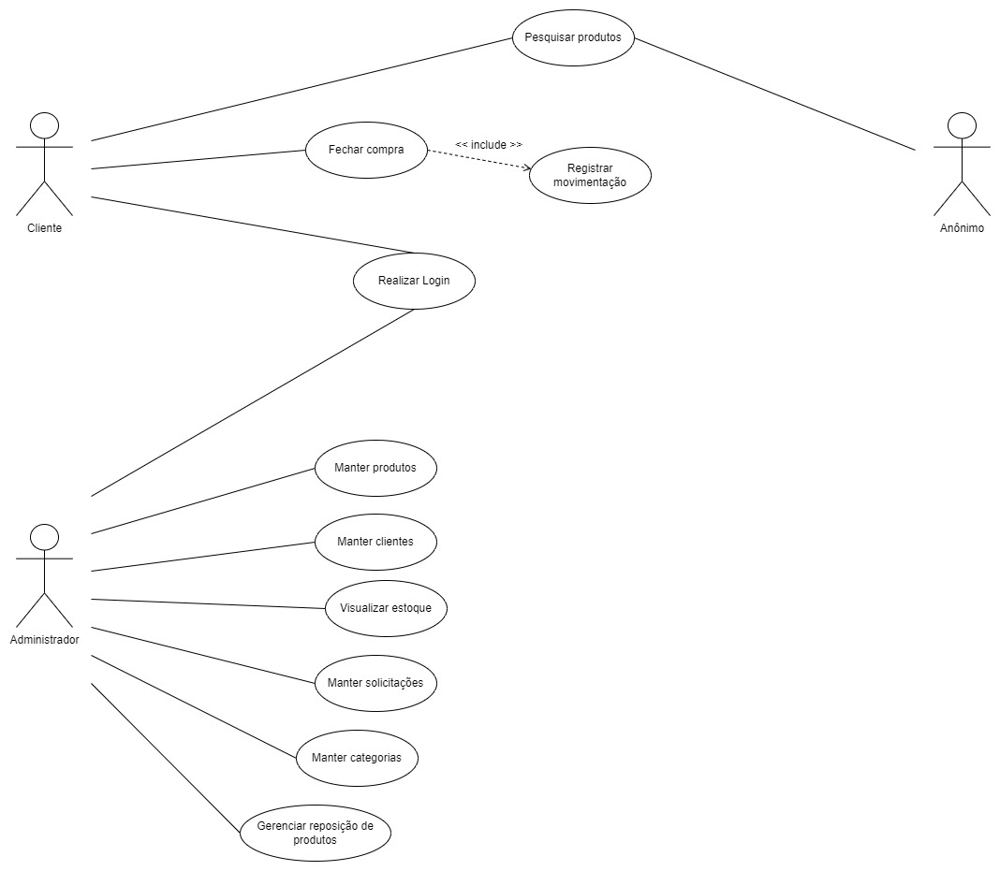

# **API RESTful PrimeTech E-commerce**
## **Escopo do produto**
O Projeto PrimeTech E-commerce é um Sistema web de comércio eletrônico que tem o intuito de facilitar a compra e venda de produtos. Todas as suas funcionalidades foram pensadas e elaboradas para proporcionar facilidade e comodidade aos usuários da plataforma.

O Sistema tem o objetivo de listar os produtos e efetuar o gerenciamento destes. Possibilitando ao administrador o controle do estoque. O cliente poderá consultar, comprar e avaliar produtos. O Sistema garante o total controle dos registros de solicitações, transações, formas de pagamento, avaliações e entregas. 

Os usuários do sistema são o Cliente e o Administrador. Todos possuem acesso ao sistema e a seu respectivo espaço. Além disso o Sistema conta com uma tela inicial que permite ao público navegar de modo simples através de filtros entre as categorias, produtos e avaliações.

A API foi desenvolvida utilizando o NodeJs, ExpressJs e Banco de dados MongoDB.
<br/>
<br/>

## **Instalação com Docker**
Clone o repositório na pasta de sua preferência.
```
git clone https://github.com/danielbarbozadasilva/ecommerce-nodejs-api
```

Abra a pasta do repositório clonado, e crie um arquivo ".env", exemplo:
```
PORT=3011
MONGO_USER=user01
MONGO_PASS=pFh7Ed2am1
MONGO_HOST=localhost:27017
MONGO_DB_NAME=ecommerce-api-teste
NODE_ENV=development
JWT_SECRET=dsfsfdsfdsdsdsfdsfs
JWT_VALID_TIME=9000000000
URL=http://localhost:3000
IMAGE_PATH=http://localhost:3011/static/

SENDGRID_SENDER=exemplo@gmail.com
SENDGRID_API_KEY=exemplo

SANDBOX_EMAIL=exemplo@sandbox.pagseguro.com.br
EMAIL=exemplo@gmail.com
TOKEN=exemplo
NOTIFICATION_URL=exemplo
```

Abra a pasta do repositório clonado, e instale as dependências do projeto através do comando:
```
npm install
```

Logo após o término da instalação. Instale o Docker e o docker compose através do link: 
```
https://docs.docker.com/desktop/windows/install/
```
Com o Docker instalado, abra o terminal na pasta do projeto e execute o seguinte comando:
```
docker-compose up
``` 

Observação: ao subir o container, o Docker executará automaticamente a migração dos 'seeders'.

Execute o comando para rodar o projeto:
```
npm run dev
```

Com o projeto rodando, abra a documentação do Swagger:
```
http://localhost:3011/api-docs/
```

Com o projeto rodando, abra a documentação do Postman na pasta do projeto:
```
docs -> API-ECOMMERCE.postman_collection.json
```
<br/>
<br/>


## **Requisitos funcionais**
<br/>

RF001 – O sistema deve controlar a autenticação dos usuários.

RF002 – O sistema deve manter cadastro de clientes.

RF003 – O sistema deve manter solicitações.

RF004 – O sistema deve alterar o status de solicitações.

RF005 – O sistema deve enviar e-mail confirmando a mudança de status nas etapas da venda.

RF006 – O sistema deve filtrar os clientes por nome ou telefone.

RF007 – O sistema deve manter clientes.

RF008 – O sistema deve manter produtos.

RF009 – O sistema deve manter categorias.

RF010 – O sistema deve favoritar produtos.

RF011 – O sistema deve alterar os dados da loja.

RF012 – O sistema deve controlar a venda de produtos.

RF013 – O sistema deve filtrar os produtos por categoria, nome e descrição.

RF014 – O sistema deve listar os produtos por ordem alfabética ou ordem de preço.

RF015 – O sistema deve calcular o valor de entrega dos produtos.

<br/>
<br/>

## **Requisitos não funcionais**
<br/>

| Identificação | Classificação | Descrição |
| --- | --- | --- |
|RNF001   |Implementação     | O back-end do sistema deve ser desenvolvido em NodeJs e ExpressJs.    |
|RNF002   |Usabilidade     | O sistema deve integrar-se ao PagSeguro.    |
|RNF003   |Implementação     | O front-end do sistema deve ser desenvolvido em ReactJs.    |
|RNF004   |Implementação     | O banco de dados a ser utilizado é o MongoDB.     |
|RNF005   |Implementação     | O sistema deve funcionar em Sistemas Operacionais Windows e Linux.    |
|  |  |  |

<br/>
<br/>

## **Regras de negócio**
<br/>

| Identificação | Classificação | Descrição |
| --- | --- | --- |
|RN001   |Controle de acesso     |Os acessos permitidos ao sistema serão: Administrador e Cliente. O usuário anônimo terá acesso apenas ao portal do site.    |
|RN002   |Recuperação de senha    | Para recuperar a senha, o Cliente deverá informar o token recebido por e-mail.     |
|RN003   |Controle de veracidade      | Para que um produto possa ser vendido, este deverá estar cadastrado no sistema.   |
|RN004   |Limite de ação     | Somente o Administrador terá permissão para incluir e alterar as categorias no sistema.    |
|RN005   |Aviso de quantidade       | O sistema notificará o Administrador caso a quantidade de um ou mais produtos seja inferior a 3 (três) unidades.   |
|RN006   |Limite de ação     | Somente o Administrador terá permissão para incluir e alterar os produtos no sistema.   |
|RN007   |Limite de ação     | O Cliente poderá visualizar apenas os dados da sua conta. Tais como: solicitações, avaliações e histórico de compras.  |
|RN008   |Limite de ação     | Apenas o Administrador poderá visualizar informações de todos os clientes, suas respectivas contas, solicitações e histórico de vendas.    |
|  |  |  |

<br/>
<br/>

## **Lista de atores e casos de uso**
<br/>

## Lista de atores que interagem com o sistema:
* Administrador
* Cliente
* Anônimo
<br/>
<br/>

## Lista de Casos de Uso:
<br/>

1 - Fechar compra

2 - Registrar movimentação

3 - Realizar Login

4 - Manter produtos

5 - Manter clientes

6 - Manter categorias

7 - Manter solicitações

8 - Pesquisar produtos    

9 - Visualizar estoque

10 - Gerenciar reposição de produto
<br/>
<br/>

## **Diagrama de Casos de uso**
<br/>


<br/>
<br/>

> ## Licença
- Licença GPLv3
<br/>
<br/>

> ## Metodologias e Padrões
* RESTful
* Conventional commits
* GitFlow
* Error handler

<br/>
<br/>
<br/>

> ## Bibliotecas e Ferramentas
* Docker
* Mongoose
* PagSeguro
* SendGrid
* Swagger
* Git
* Formidable
* Crypto
* Uuid
* Path
* Joi
* Http-status
* Nodemon
* JsonWebToken
* Express
* Eslint
* Prettier
* FileSystem